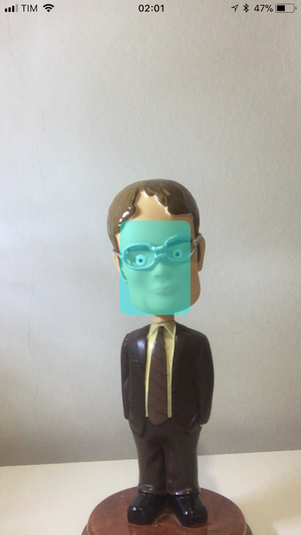

#  Core ML demos

This repository contains demos of Apple's Core ML and Vision frameworks made available to developers in iOS 11.

The following demos are present in this project:

1. Sentiment analysis of an input text using Core ML.
2. Face detection using the Vision framework with camera data.
3. Real-time object classification using Core ML + Vision.

Menu                          |  Sentiment Analysis                             |  Face Detection                         |  Object Recognition
:----------------------------:|:-----------------------------------------------:|:---------------------------------------:|:---------------------------------------------:
 | |  | 

## How the project is structured
The project is mainly composed of multiple view controllers. Each one contains the logic for each demo:

1. `SentimentAnalysisViewController`: sentiment analysis demo
2. `FaceDetectionViewController`: face detection demo.
3. `ClassificationViewController`: object classification demo.

The demos that use stream data from the camera use the `CameraCapture` utility class created to extract images from the camera. It is built on top of `AVFoundation` and it contains two main features:

1. Provides to a delegate object the current frame as a `CVImageBuffer` object, which can be directly used as input to the Vision pipeline. 
2. Provides a `CALayer` that can be used by the view controller to efficiently display the current frame.

Finally, the `Main.storyboard` file contains the views of all the mentioned view controllers and a simplistic introduction menu view.

## Models
The ML models used in this project were not included in the repository.

The sentiment analysis and object classification demos use the following models:

1. Sentiment Analysis: [Sentiment polarity LinearSVC](https://coreml.store/sentimentpolarity?download) made by [Vadym Markov](https://github.com/vadymmarkov).
2. Object classification: [SqueezeNet](https://developer.apple.com/machine-learning/) ([paper](https://arxiv.org/abs/1602.07360)).

Note that you can easily replace the Core ML model in the object classification project. If the model contains only one image as input, it is just a matter of replacing the only occurrence of the `SqueezeNet` keyword in the project to the name of the new model (e.g. `Inceptionv3`).

## Building the app
First, download the Core ML models described in [Models](#models). Then, simply open the project in Xcode 9 or later, and you're all set!